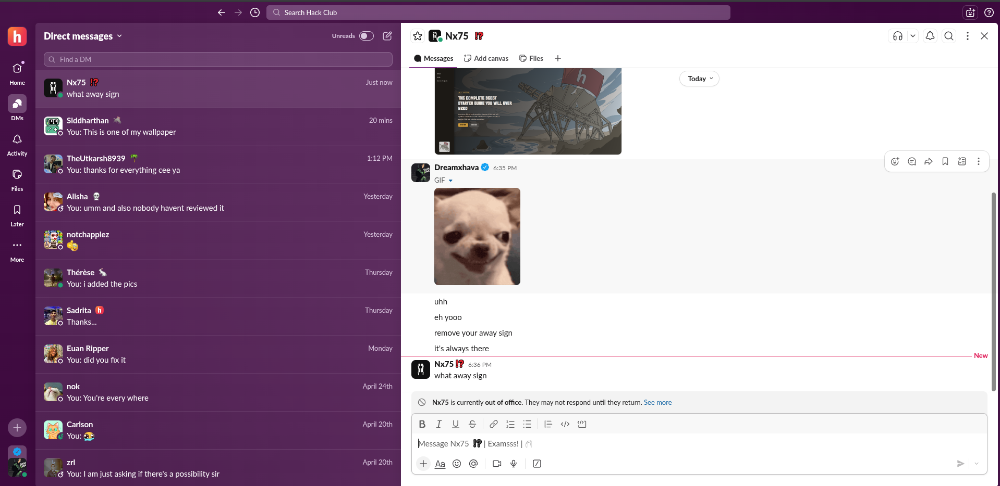

# my-portfolio
This is the what you called the personal site I made for myself and it was so much hard than creating a normal project since it was based on my life and projects I made.

In the project I included the information about myself and explained some github repos done by me and I also mentioned the ways to message me by adding the social media links at the bottom.

 ---

## Technologies I have used

so to make this work I have used the following types of technologies in my site,

   1. HTML
   2. vanilla 
   3. css
   4. javascript

And it also have the links of some projects done by me in various languages like python, c++ and bash.

